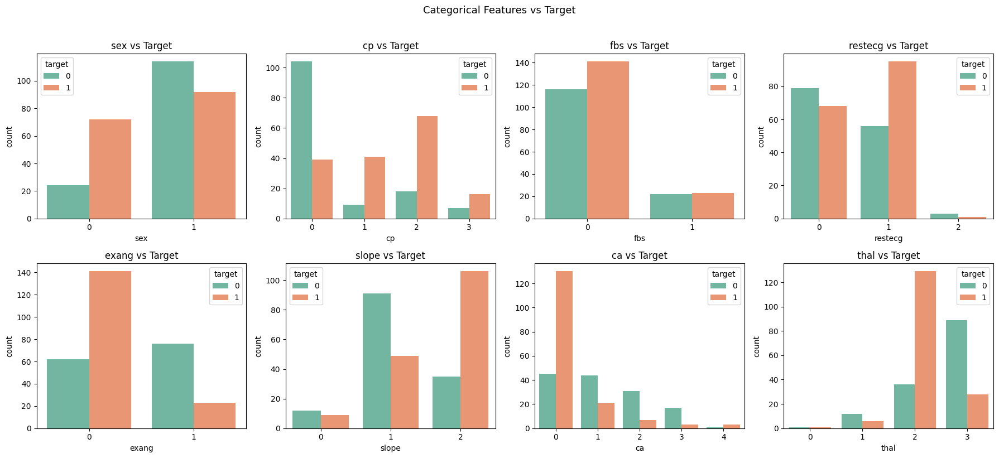
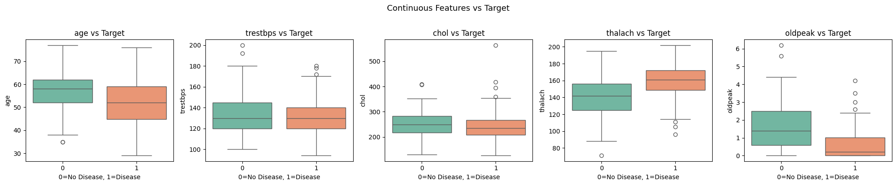
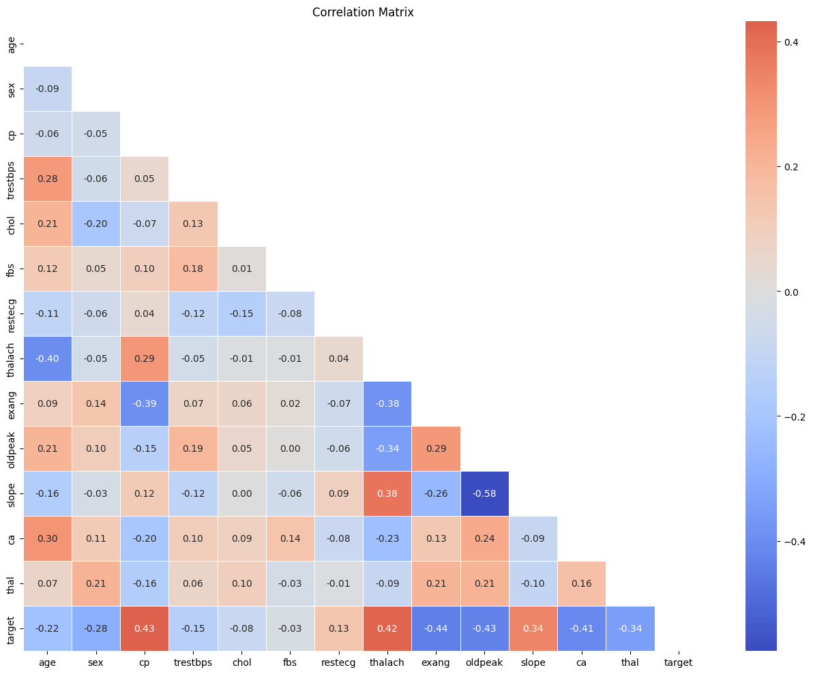

# Heart Disease Prediction using Machine Learning

## Overview
This project builds a machine learning model to predict heart disease using clinical and engineered features.

It demonstrates a ML pipeline:

- Exploratory Data Analysis (EDA)
- Feature Engineering
- Model Training & Evaluation
- Model Comparison
- Interpretability (SHAP)
- Final Model Selection

## Problem statement

Predict whether a patient has heart disease:

- 0 → No disease
- 1 → Disease

This is a **binary classification problem**.

## Dataset

- Source: [Kaggle Heart Disease dataset](https://www.kaggle.com/datasets/johnsmith88/heart-disease-dataset)
- ~300 patient records
- Includes clinical variables such as:
    - Age 
    - Sex (0=female, 1=male) 
    - cp (Chest pain type) (0-3 scale)
    - thalach (Maximum heart rate): The highest heart rate archived during excercise
    - thal (thalassemia): A blood disorder result(0-3 range)
    - trestbps (resting blood pressure): In mmHg on admission to the hospital.
    - chol (serum cholesterol): mg/dl
    - oldpeak (ST depression): ST depression induced by exercise relative to rest
    - fbs (fasting blood sugar): >120 mg/dl (1=true, 0=false)
    - restecg (resting ECG): (0-2 range)
    - exang (exercise-induced angina) (1=yes, 0=no)
    - ca(number of major vessels) (0-4 range)
    - slope: the slope of the peak exercise ST segment (0-2 range)
    


## Project Structure

## Project Structure


```text
.
├── data/
│   ├── raw/               
│   └── processed/          
│
├── notebooks/
│   ├── 01_eda.ipynb     
│   ├── 02_preprocessing.ipynb
│   ├── 03_modeling.ipynb
│   └── 04_explainability.ipynb   
│
├── src/
│   ├── __init__.py
│   ├── data/
│   │   ├── load_data.py
│   │   ├── preprocess.py
│   │   └── split_data.py
│   │
│   ├── features/
│   │   └── build_features.py
│   │
│   ├── models/
│   │   ├── train.py
│   │   ├── predict.py
│   │   ├── evaluate.py
│   │   └── explain.py
│   │
│   ├── visualization/
│   │   └── plots.py
│   │
│   └── utils/
│       ├── config.py
│       └── helpers.py
│
├── models/
│   ├── best_model.pkl
│   └── preprocessor.pkl
│
│
├── tests/
│   ├── test_preprocess.py
│   ├── test_features.py
│   └── test_predict.py
│
├── requirements.txt
├── README.md
└── .gitignore
```


## Tech Stack

- Python
- Pandas
- Scikit-learn
- XGBoost
- SHAP
- Matplotlib / Seaborn

## Installation & Setup

This project follows a modular structure to allow easy reproducibility and scalability across environments.

### 1. Clone the repository

```bash
git clone https://github.com/your-username/heart-disease-ml.git
cd heart-disease-ml
```

### 2. Create a virtual environment

```bash
python -m venv venv
source venv/bin/activate   # Mac/Linux
venv\Scripts\activate      # Windows
```

### 3. Install dependencies

```bash
pip install -r requirements.txt
```

Make sure you have Python 3.9+ installed

### 4. Run the project

```bash
python src/train.py
```

## Exploratory Data Analysis

### Categorical attributes



### Continuous attributes




## Feature Engineering

- **Cardiac Capacity** = `thalach / age`  
  → captures heart performance relative to patient age

- **Ischemia Score** = normalized `oldpeak` + `exang` + `ca`  
  → combines multiple indicators of heart stress into a single metric

- **Estimated Stroke Volume** = `(trestbps / thalach) * (age / 50)`  
  → approximates cardiovascular efficiency under stress

## Correlation festures



## Insight

Feature engineering improved performance from:  86% → 93% accuracy (+7%)

## Ablation Study

Feature Set	Accuracy
Base features	86%
Reduced engineered features	89%
Full feature set	93%

## Models Evaluated
- Logistic Regression
- Random Forest
- XGBoost

## Model Performance

Model	AUC
Logistic Regression	0.91
XGBoost	0.98
Random Forest	0.999

## Cross-Validation (5-fold)

Model	CV AUC	Std
Logistic Regression	0.906	±0.034
XGBoost	0.981	±0.012
Random Forest	0.9987	±0.0025

Random Forest achieved the highest performance with extremely low variance, indicating strong generalization.

## Model Interpretability (SHAP)

SHAP was used to analyze feature contributions.

Findings:
No single feature dominates the model
Top feature contributes ~29% of total importance
Model relies on multiple complementary signals


.png)


# Confusion Matrix

[[91  9]
 [ 5 100]]
False Negatives: 5
False Positives: 9

The model achieves 95% recall for disease detection, minimizing missed cases — critical in healthcare.

.png)


# ROC Curve
 
ROC-AUC ≈ 0.98–0.999
Curve close to top-left corner

The model demonstrates excellent class separability and robustness across thresholds.

.png)

## Final Model
Random Forest
- Highest AUC
- Lowest variance
- Strong generalization
- Simpler than XGBoost

## Key Takeaways

Feature engineering can significantly improve performance
Cross-validation is essential for model validation
SHAP helps avoid misleading feature importance interpretations
Model selection should consider both performance and stability

## Conclusion

This project demonstrates a complete machine learning workflow, from data exploration to model selection, highlighting the impact of feature engineering and proper validation techniques.


## Author

Jhoselyn Miluska Pajuelo
Software Engineer | ML Enthusiast